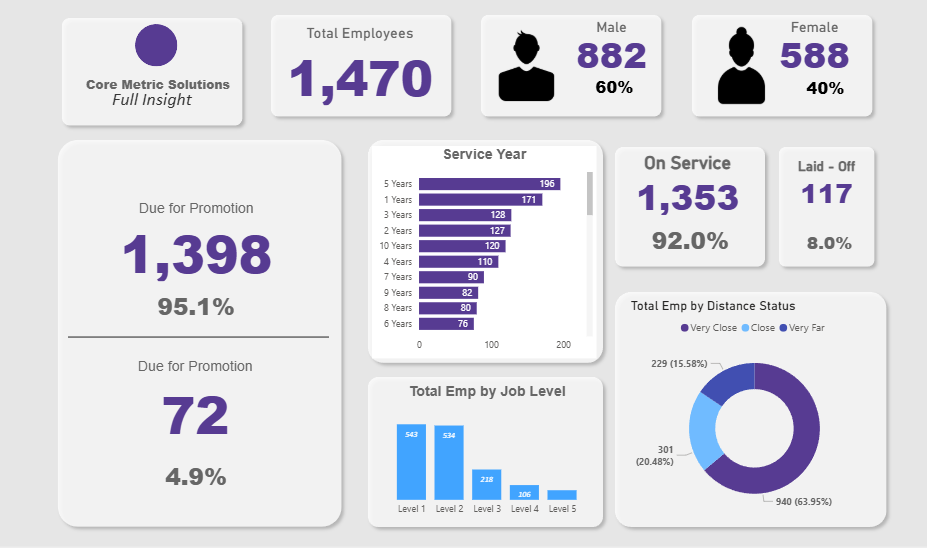

# CoreMetric Solutions — HR Analytics Dashboard
In this project, I developed a dynamic HR analytics dashboard in Power BI for a simulated organization, CoreMetric Solutions. My objective was to transform raw workforce data into a centralized, executive-ready dashboard that supports strategic HR decision-making.

I focused on visualizing employee distribution, promotion readiness, tenure trends, workforce composition, and commuting patterns. Through data modeling and DAX calculations, I created an interactive dashboard that enables HR leaders to monitor workforce health, identify advancement opportunities, and support retention planning.

---

## Project Objectives
In this analysis i aimed to answer the following business questions:
1. What is the total number of employees and how are they distributed by gender?  
2. How many employees are due for promotion, and what is the overall promotion readiness rate?  
3. How long have employees been with the company, and what does tenure distribution look like?  
4. What percentage of employees are currently active versus laid off?  
5. How are employees distributed across different job levels?  
6. What is the distance breakdown between employee homes and the workplace?  
7. How can we use this data to drive retention, planning, and promotion strategies?

---

## Dashboard Preview

---

## Tools & Technical Approach
In this project, I used:
- Power BI Desktop
- Data modeling with relationships between employee attributes
- DAX measures for KPIs (promotion rate, active employee %, gender split)
- Calculated columns for tenure grouping and distance segmentation
- KPI Cards for executive-level summaries
- Bar charts for tenure and job-level distribution
- Donut chart for commute distance visualization
- Slicers to enable interactive filtering
- Professional dashboard layout using UI/UX best practices
I structured the dashboard to prioritize high-level KPIs at the top, followed by distribution-based visuals to support deeper workforce analysis.
---

## Key Insights / Results
Through this dashboard, I identified:
- A total workforce of 1,470 employees, with a 60% male and 40% female distribution.
- 95.1% of employees are currently due for promotion, indicating potential advancement planning needs.
- The majority of employees fall within the 1–5 year tenure range, suggesting a relatively early-career workforce.
- 92% of employees are actively on service, while 8% have been laid off.
- Level 1 and Level 2 roles make up the largest share of the workforce, highlighting a strong operational base.
- 64% of employees live very close to the workplace, potentially supporting lower commute-related attrition risk.
---

## What I Learned
Through this project, I strengthened my ability to:
- Build structured data models in Power BI
- Write DAX measures for KPI calculations and percentage metrics
- Design dashboards for executive-level reporting
- Translate HR data into actionable workforce insights
- Apply data visualization best practices for clarity and usability
I also gained practical experience presenting HR metrics in a way that aligns with strategic workforce decision-making.
--- 

## Challenges I Encountered
One challenge I faced was ensuring accurate percentage calculations when building promotion readiness and workforce status metrics. I addressed this by creating properly structured DAX measures rather than relying on implicit calculations.

Another challenge involved grouping tenure and distance categories in a way that remained meaningful yet visually clear. I resolved this by creating calculated columns and validating category logic before visualization.

Additionally, designing a clean and executive-friendly layout required thoughtful spacing, visual hierarchy, and consistent color usage to ensure readability.

--- 

## Dataset Overview 
The dataset included the following attributes:
- Employee ID and gender
- Retrenchment status (On service or laid off)
- Years of service
- Job level classification (Levels 1–5)
- Promotion status (Due vs. Not Due)
- Distance to office (Very Close, Close, Very Far)
